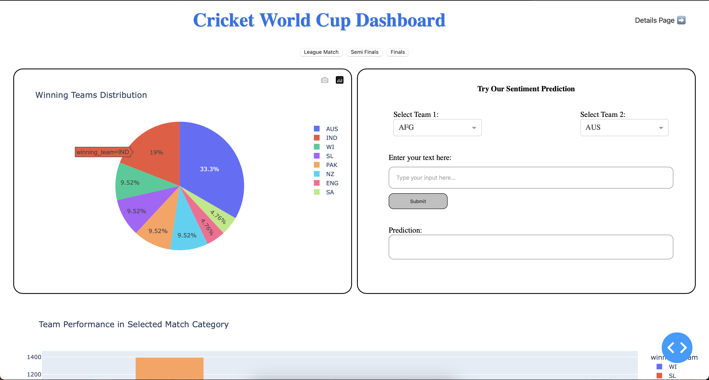

# World Cup Match Analysis Dashboard



## Project Overview
This project provides an interactive dashboard for analyzing World Cup match data. It displays match statistics, winning team distributions, and team performance in selected match categories, such as group stages, semi-finals, and finals. The dashboard also allows users to filter data by year and team to explore detailed match information, including the total number of matches played and abandoned matches.

### Key Features:
- **Main Page**: Displays winning team distribution and team performance in selected match categories.
- **Details Page**: Provides match details filtered by year and team, showing total matches, played matches, abandoned matches, and relevant graphs.
- **Sentiment Analysis**: Allows users to input team-related text and predicts sentiment based on the input.

## Tech Stack
- **Python**: Backend development.
- **Dash by Plotly**: Frontend dashboard for interactivity.
- **Pandas**: Data manipulation and analysis.
- **Plotly**: For interactive charts and graphs.

## Prerequisites
Before running this project, ensure you have the following installed on your local machine:

1. **Python 3.x**
2. **pip** (Python package manager)

## Installation

### 1. Clone the Repository
Clone this repository to your local machine using the following command:

```bash
git clone https://github.com/nuwan-dharmarathna/worldcup-analysis.git

### 2. Install Dependancies

```bash
cd worldcup-analysis
pip install -r requirements.txt

### Run the Application

```bash
cd dashboard
python app.py

### Key Points:

- **Image**: The image is referenced with a relative path `assets/images/dashboard-screenshot.png`. Adjust the path as needed.
- **Steps to Run**: Clear instructions are provided for cloning the repo, installing dependencies, running the app, and exploring the dashboard.
- **Project Structure**: A quick summary of the important files and their roles in the project.
